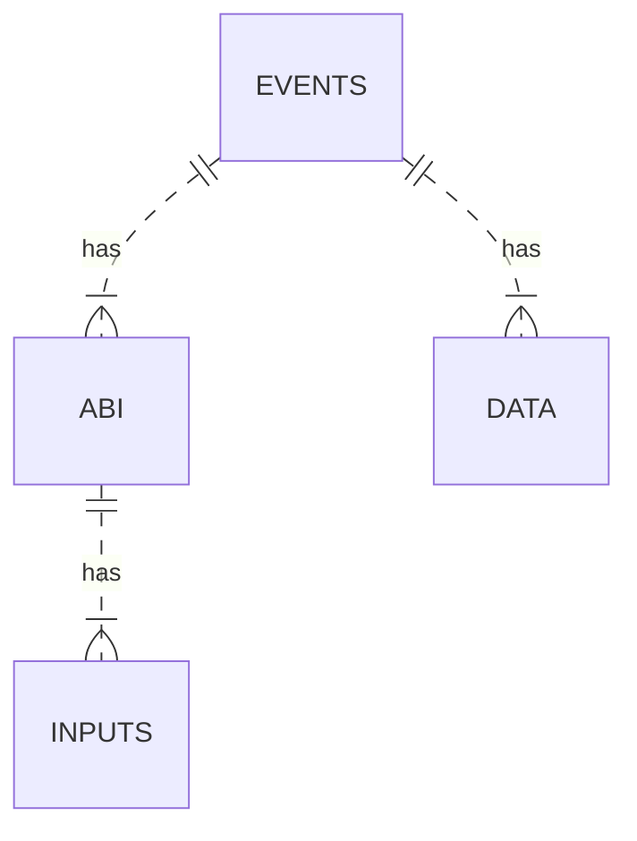
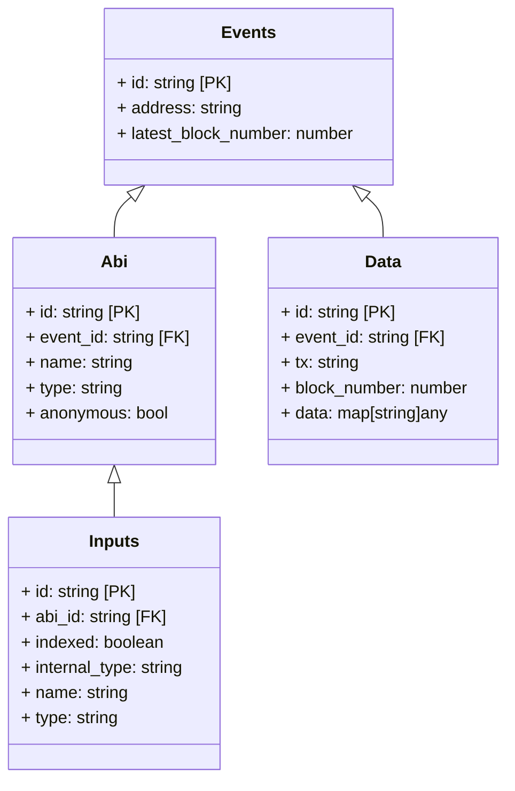
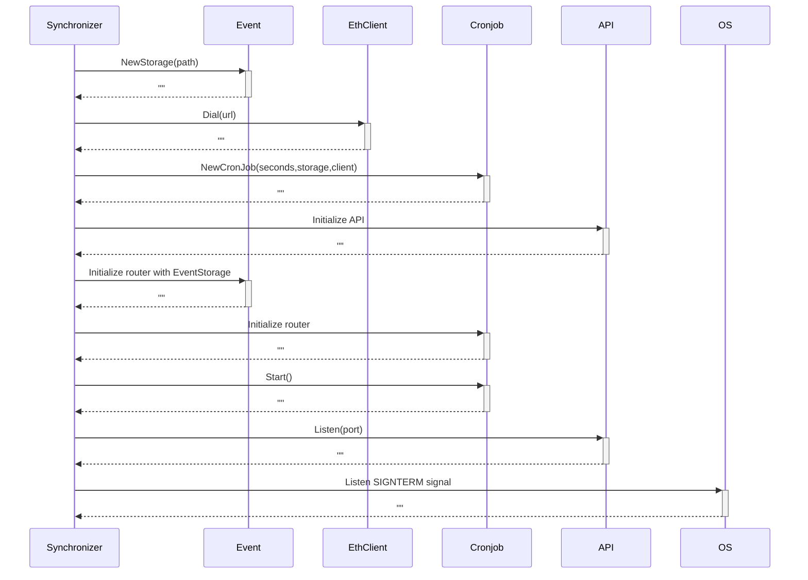
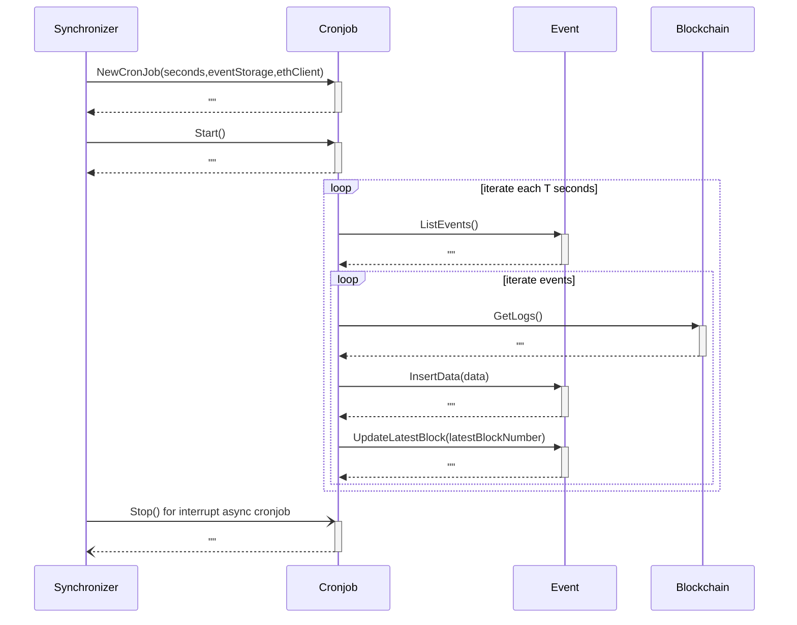

# Synchronizer

## Reviewers

- github.com/cagodoy
- github.com/mtavano
- github.com/nicobarra

## Definition

Synchronizer is a service designed to manage the synchronization of contract events inside a off-chain database.

### Context

The service design is based on the complex situations when we used the Moralis service. On the other hand, the target of this solution is to provide access to the user through to their own cloud provider. By this way, the user can pay the actual cost of the cloud and not the costs charged for a third-party solution, for example, a SaaS service like Moralis or another Web3 solution.

### Why we doing this?

The target of our own solution is because getting information on the blockchain is complex and slow, especially if it has other associated prices, for example, pay to the Ethereum explorer API. It is even more if the query is made from the frontend application, this situation detracts from UX by the wait time needed by the user.

In addition, the current solution with libraries like ethersjs does not allow the flexibility to make complex queries because only allows made limited filters. Our solution inside an off-chain database will allow adding an extra layer over the data, simplifying to the user the consumption of the service.

### Diagrams

The architecture diagrams are in the following link:
https://app.diagrams.net/?src=about#G1PxvFkkQKAgMXKkp0dnIGnzweYV3uBXMT

### Proposal solution v1 (DFP)

The first solution was designed for the product `Defi for People`. This solution was implemented using TypeScript as the main programming language. While we worked as a first solution, we noticed that it had a lot of limitations or restriction because we were using a relational database with specific models in the repository code, for this reason, the solution is specific to the project `DFP`

This implementation is a base for thinking of a better way to implement this, it's not easy, but it's necessary a solution can be used for different users and contexts, independently of the smart contract that is using.

### Proposal solution v2 (Cron/DB/API)

The v2 is the first MVP implemented by `Darch Labs`. The solution it's implemented using `Golang` language. The main work uses a Cronjob that, based on an inserted ABI, it is possible to get the related information from the event, specified in it.

The Cron is triggered using programming language, for this reason, the solution needed a lot of care in a broken case while an event is listening, because if the service is crash, it would affect to all the events listener that are running at that moment.

The v2 provides an application interface for managing the events, for example: getting events, adding a new event, and removing a specific event.

### Proposal solution v3 (Cron/DB/API)

In the future, we are planning to use independent processes to manage the instances separately. this approach is better because each process doesn't affect any other synchronizer.

We think that we can use the Kubernetes cluster with native cronjob implementation to run all synchonizers. Also with this approach, we can offer more scalability to our clients.

## Diagrams

### Entity Relationship

### Data Model

### API Flow

### Cronjob Flow

